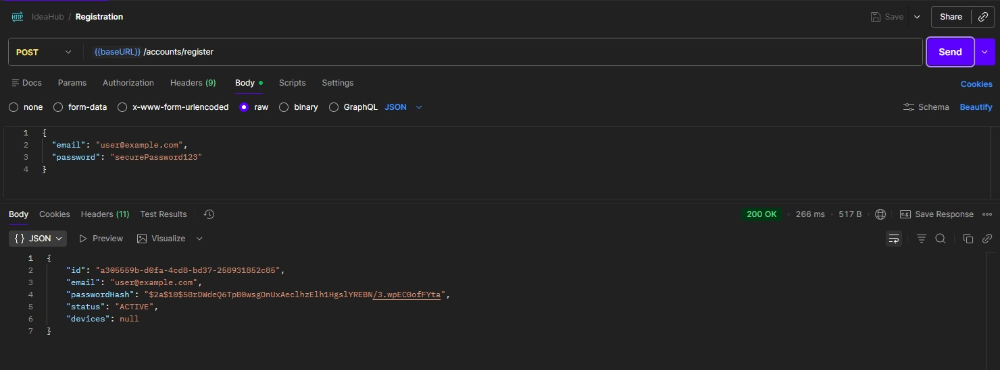
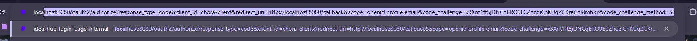
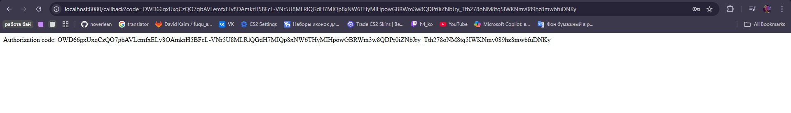
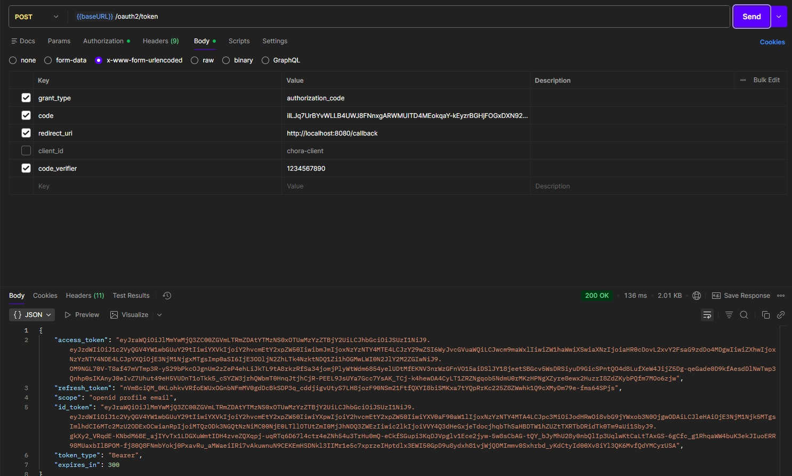

# ☕ Chora_Auth — Authentication Microservice for Chora System

Chora_Auth is a standalone authentication microservice built with **Spring Authorization Server**, implementing secure OAuth2 flows with **PKCE**, **JWT**, and **device-aware login**.

Users are guided through a full OAuth2 authorization flow, with support for multiple devices — each linked to the account via unique key pairs.

## 🌐 Languages

- 🇷🇺 [Русский](README.ru.md)

---

## 🔐 Features

- OAuth2 Authorization Code flow with PKCE
- Device-aware authentication (per-device key pairs)
- JWT access and refresh tokens
- Custom login page with glassmorphism UI (React)
- Consent page customization
- Token revocation and refresh tracking
- Spring Security integration with custom error handling

---

## 🚀 Getting Started

### Prerequisites

- Java 17+
- Node.js (for frontend)
- Docker (optional for deployment)

## 🧩 Architecture
- Spring Authorization Server — core OAuth2 engine
- React frontend — custom login UI
- JWT + JWK — token generation and validation
- Device fingerprinting — per-device refresh token tracking
- PostgreSQL — persistent storage (optional)

---

# Клиентский жизненный цикл

### 1. 🖼️ User registration 

### 2. 🖼️ Redirect From Client

### 3. 🖼️ Login Form

### 4. 🖼️ Client Code

### 5. 🖼️ Token Pair

